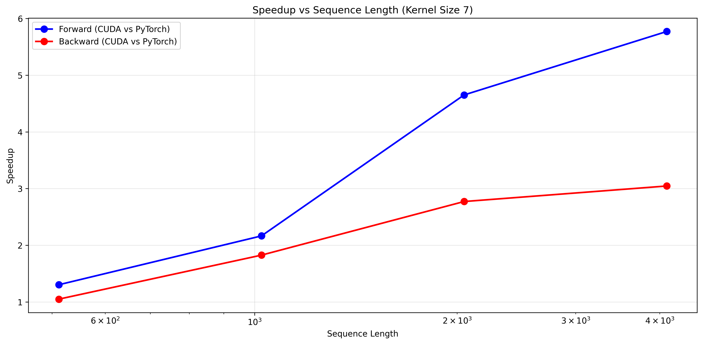
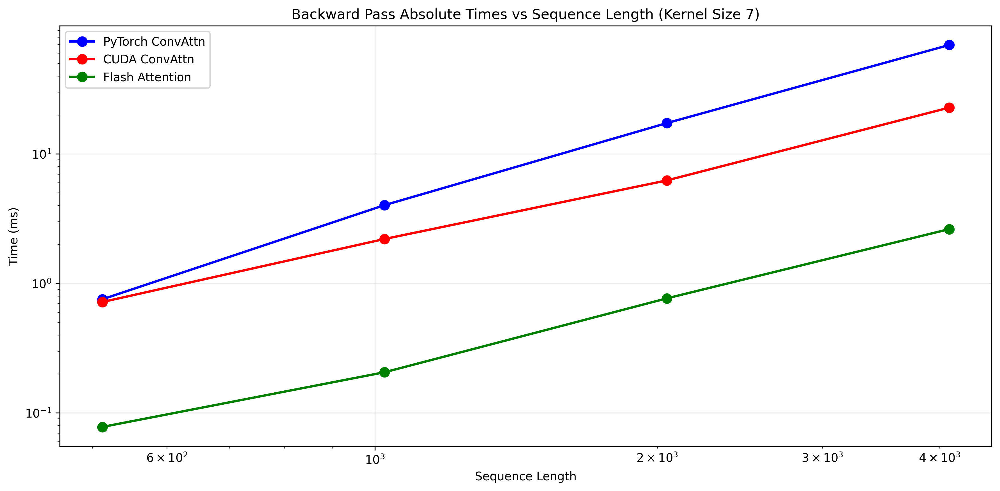
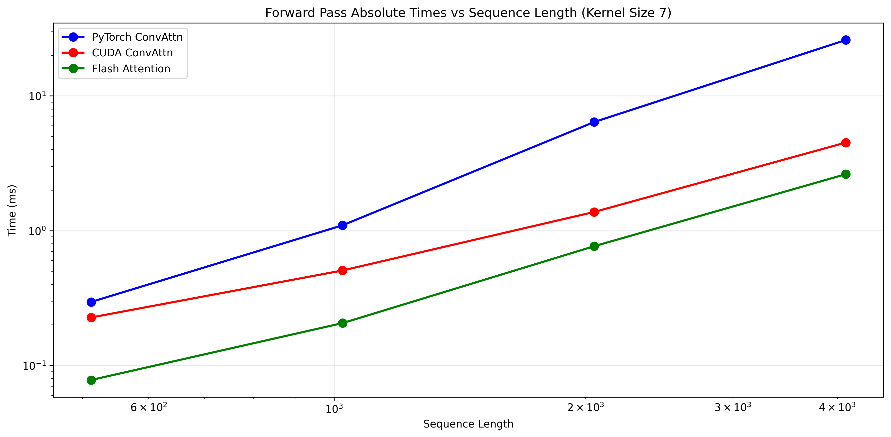
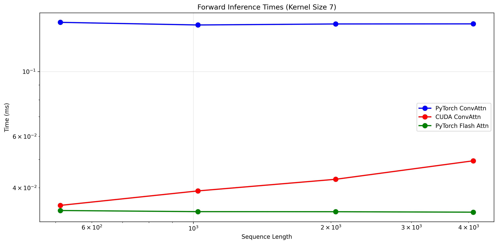

Implementations of multi token attention in CUDA and Triton.

- (Paper)[https://arxiv.org/abs/2504.00927]
- (Original implementation)[https://github.com/facebookresearch/RAM/tree/main/projects/mta]


## Conv Attention ##

In this variant, there is only a convolution before the softmax. 

$$
A = \text{Softmax} \ \text{Conv2d}_{\theta}(\hat{A})
$$

$$
a_{ij} = \text{Softmax} \left( \frac{c_{q-1}}{\sqrt{d}} \sum_{i'=0}^{\lceil c_k/2 \rceil-1} \sum_{j'=-\lfloor c_k/2 \rfloor}^{\lfloor c_k/2 \rfloor} 1_{i \ge j-j'} \theta_{i',j'} q_{i-i'}^{\top} k_{j-j'} \right)
$$

And the output:

```math
\text{Out}_{jh} = \left( \sum a_{ji} \dot V_{ih} \right)
```


The implementation fuses all these operations in a single CUDA kernel, using the main ideas of tiling and online softmax from Flash Attention.

Because of the convolution, the tiles overlap each other, and there are some values of the Q*K^T matrix that are recomputed.


This kernel achieves some speedup compared with the pytorch implementation:


Because of the unavoidable extra computations involved in the convolution, it is slower than standard flash attention in the training workload:




However, during inference, memory bandwith is the bottleneck and increasing arithmetic intensity doesnt affect the performance as much:



